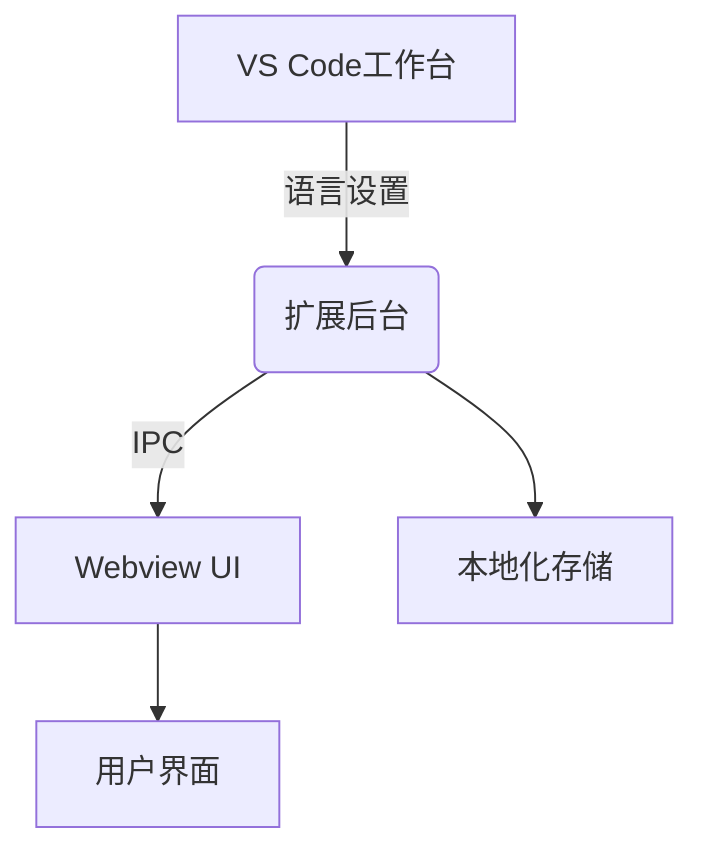

# VS Code插件国际化架构指南

## 1. 架构设计原则



**核心特性**：

- 双环境隔离：后台(Node.js) / 前端(Browser)
- 统一翻译引擎：costrict-i18n
- 自动同步机制

## 2. 核心模块：costrict-i18n

### 功能组件

```typescript
// 基础架构
const zgsmTranslations = {
	en: { common: { ok: "OK" } },
	zh_CN: { common: { ok: "确定" } },
}

// 资源合并引擎
function mergeLanguageResources(project, zgsm) {
	// 深度合并逻辑
}
```

### 设计特点

1. **可扩展性**：支持覆盖基础翻译
2. **环境适配**：自动切换加载方式
3. **热更新**：Webview实时生效

## 3. 后台实现（src/i18n）

### 初始化流程

```ts
// setup.ts
if (!isTestEnv) {
	// 同步加载翻译文件
	const content = fs.readFileSync(filePath)
	translations[lang][ns] = JSON.parse(content)
}

// 合并基础资源
const merged = mergeLanguageResources(translations, zgsmTranslations)

// 初始化i18next
i18next.init({ resources: merged })
```

### 关键特性

- **测试优化**：跳过文件加载
- **安全加载**：try/catch错误隔离
- **性能优化**：按需加载语言包

## 4. Webview UI实现（webview-ui/src/i18n）

### 动态加载机制

```ts
// setup.ts
const localeFiles = import.meta.glob("./locales/**/*.json", { eager: true })

Object.entries(localeFiles).forEach(([path, module]) => {
	// 提取语言/命名空间
	const match = path.match(/\.\/locales\/([^/]+)\/(.+)\.json/)
	// 资源注入
})
```

### 响应式语言切换

```tsx
// TranslationContext.tsx
useEffect(() => {
	i18n.changeLanguage(extensionState.language)
}, [extensionState.language])
```

## 5. 双环境交互协议

### 通信流程

```mermaid
sequenceDiagram
  工作台->>后台： vscode.getConfiguration('locale')
  后台->>Webview： postMessage({ type: 'LANG_UPDATE', payload: 'zh_CN' })
  Webview->>UI： 触发i18n.changeLanguage()
```

### 数据同步

| 场景     | 协议     | 频率 |
| -------- | -------- | ---- |
| 初始加载 | 同步消息 | 1次  |
| 语言切换 | 即时消息 | 实时 |
| 资源更新 | 批量消息 | 按需 |

## 6. 开发实践

### 添加新语言

```bash
# 后台资源
mkdir -p src/i18n/locales/fr
echo '{"common": {"cancel": "Annuler"}}' > src/i18n/locales/fr/common.json

# Webview资源
mkdir -p webview-ui/src/i18n/locales/fr
echo '{"common": {"cancel": "Annuler"}}' > webview-ui/src/i18n/locales/fr/common.json

# 注册语言
// shared/language.ts
export const ZGSM_LANGUAGES = {
  ...,
  fr: "Français"
};
```

### 翻译键使用规范

```ts
// 后台
t("zgsm:common.cancel")

// Webview
t("project:checkout.title")
```

## 7. 调试与优化

### 调试命令

```bash
# 查看加载资源
grep -r "Loaded translations" src

# 检查合并结果
console.log('Merged:', mergedTranslations);
```

### 性能优化

1. **分块加载**：大语言包按需加载
2. **缓存策略**：localStorage存储常用翻译
3. **树摇优化**：Vite生产构建自动去除未用翻译
